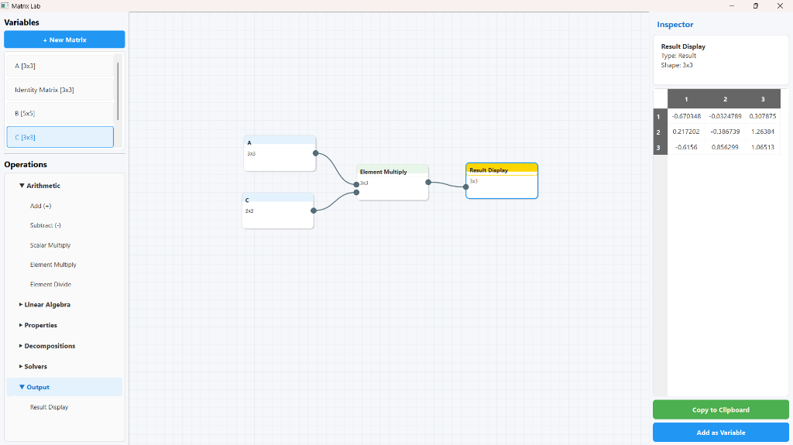

# 🧮 Matrix Lab

**Matrix Lab** is a powerful, node-based visual programming environment designed specifically for matrix operations and linear algebra experimentation. Built with Python and PySide6, it offers an intuitive "clean lab" interface where users can interactively manipulate matrices, perform complex calculations, and visualize results in real-time.



## ✨ Key Features

- **Visual Node Graph**: Create complex calculation flows by connecting nodes on an infinite canvas.
- **Interactive Matrix Editor**:
    - Create matrices with custom dimensions.
    - Quick-fill options (Identity, Zeros, Random).
    - Auto-resizing cells for better visibility.
- **Comprehensive Operations Library**:
    - **Arithmetic**: Add, Subtract, Scalar Multiply, Element-wise Multiply/Divide.
    - **Linear Algebra**: Dot Product, Cross Product, Transpose, Inverse, Pseudo-Inverse.
    - **Properties**: Determinant, Trace, Rank.
    - **Decompositions**: Eigenvalues, Eigenvectors, SVD.
    - **Solvers**: Linear System Solver (Ax = B).
- **Inspector Panel**:
    - Real-time result preview.
    - Detailed matrix information (Shape, Type, Values).
    - **One-click "Add as Variable"** feature to reuse calculation results.
    - copy to clipboard functionality.
- **Variable Management**: Sticky sidebar to manage and reuse named matrix variables.
- **Modern UI/UX**: clean, professional aesthetic with responsive panels and intuitive drag-and-drop interactions.

## 🚀 Installation

### Prerequisites
- Python 3.8 or higher
- pip (Python package installer)

### Setup Steps

1. **Clone the repository**
   ```bash
   git clone https://github.com/yourusername/matrix-lab.git
   cd matrix-lab
   ```

2. **Create a virtual environment (optional but recommended)**
   ```bash
   # Windows
   python -m venv venv
   .\venv\Scripts\activate

   # macOS/Linux
   python3 -m venv venv
   source venv/bin/activate
   ```

3. **Install dependencies**
   ```bash
   pip install -r requirements.txt
   ```

## 🎮 Usage

1. **Run the application**:
   ```bash
   python main.py
   ```

2. **Create Data**:
   - Variables Panel (Left): Click **+ New Matrix** to define a base matrix.
   - Drag the new variable onto the canvas to create a Data Node.

3. **Perform Operations**:
   - Drag an operation (e.g., `Add`, `Dot Product`) from the Operations list onto the canvas.
   - Connect the output socket of your Data Node to the input socket of the Operation Node.

4. **View Results**:
   - Connect the operation output to a `Result` node (or click the operation node directly).
   - The **Inspector Panel** (Right) will show the computed matrix.
   - Click **Add as Variable** in the Inspector to save the result for further calculations.

5. **Tips**:
   - **Double-click** a variable in the sidebar to edit it.
   - **Delete key** removes selected nodes, wires, or sidebar variables.
   - **Right-click + Drag** to pan the canvas.
   - **Scroll** to zoom in/out.

6. **Node Documentation**:
   - A walkthrough of how to use the nodes can be found in [NODE_DOCUMENTATION.md](NODE_DOCUMENTATION.md).

## 📂 Project Structure

```
Matrix Lab/
├── assets/              # Static assets (images, icons)
├── dialogs/             # Modal dialogs (Matrix Editor)
├── model/               # Core logic (Node data, Graph processing)
├── view/                # UI Components (Canvas, Sidebar, Inspector)
├── main.py              # Application entry point
├── requirements.txt     # Python dependencies
├── NODE_DOCUMENTATION.md # Detailed usage guide for all nodes
└── README.md            # Project documentation
```

## 🤝 Contributing

Contributions are welcome! If you have ideas for new features or matrix operations:

1. Fork the repository.
2. Create your feature branch (`git checkout -b feature/AmazingFeature`).
3. Commit your changes.
4. Push to the branch.
5. Open a Pull Request.

## 📄 License

This project is licensed under the MIT License - see the LICENSE file for details.

---
*Built with ❤️ using PySide6 and NumPy*
